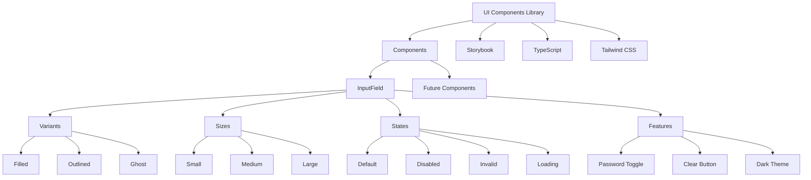
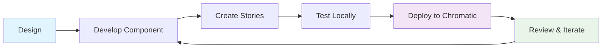
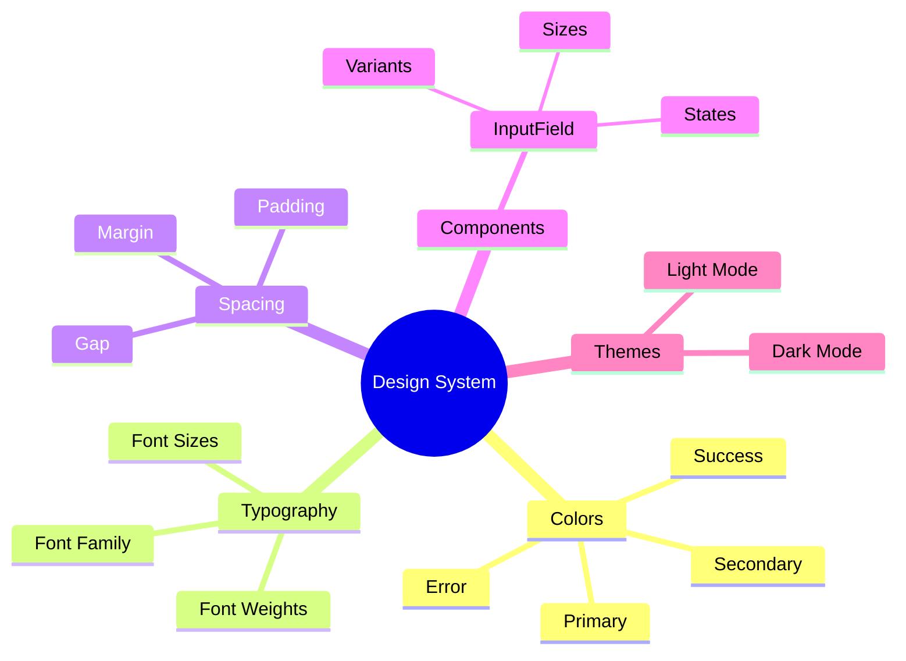
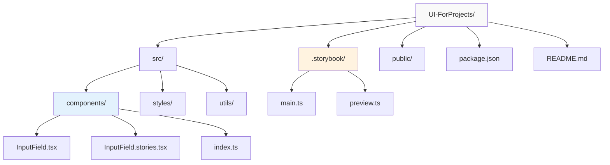

# UI Components Library

A modern React component library built with TypeScript and Storybook.

## 🌟 **Live Demo**
### 👉 **[View Components Library](https://68a095e666964889d14143db-fqhuflqkfh.chromatic.com/)** 👈

> **Explore all components, variants, and interactive features in our hosted Storybook!**

---

## 🏗️ Architecture Overview



## 🚀 Quick Start

### Prerequisites
- Node.js 18+ 
- npm or yarn

### Installation
```bash
git clone https://github.com/yourusername/UI-ForProjects.git
cd UI-ForProjects
npm install
```

### Development
```bash
# Start Storybook
npm run storybook

# Build components
npm run build

# Run tests
npm test
```

## 📦 Components

### InputField
A versatile input component with multiple variants and states.

**Features:**
- Multiple variants (filled, outlined, ghost)
- Size options (sm, md, lg)
- Interactive states (disabled, invalid, loading)
- Password toggle and clear functionality
- Dark theme support

## 🔄 Development Workflow



## 🎨 Design System



## 🏁 Component State Flow

```mermaid
stateDiagram-v2
    [*] --> Default
    Default --> Focused: User focuses
    Default --> Disabled: disabled prop
    
    Focused --> Typing: User types
    Focused --> Default: User blurs
    
    Typing --> Valid: Valid input
    Typing --> Invalid: Invalid input
    Typing --> Default: User blurs
    
    Valid --> Default: User blurs
    Invalid --> Default: User blurs
    Invalid --> Valid: User corrects
    
    Disabled --> [*]: Component unmounted
```

Built with accessibility and consistency in mind, following modern UI patterns.

## 📖 Documentation & Demo
- **Live Components**: [Chromatic Storybook](https://68a095e666964889d14143db-fqhuflqkfh.chromatic.com/)
- **Interactive Examples**: Try all variants and states
- **Design Tokens**: Consistent spacing, colors, and typography

## 🛠️ Development Approach
- Component-driven development
- TypeScript for type safety
- Accessibility-first design
- Customizable theming system
- Comprehensive testing with Storybook

## 📁 Project Structure

